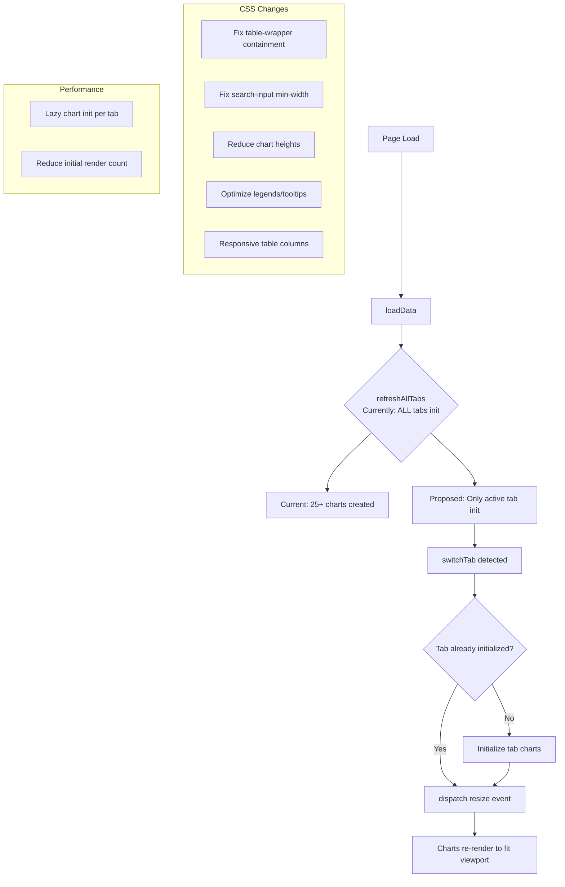

# Mobile UX Optimization Plan

## Overview

Comprehensive audit and optimization of the AntiGravity Portfolio app for mobile browsing. Current layout is desktop-first with minimal responsive handling. The app renders all tab content upfront with no lazy loading, causing significant initial payload on mobile devices.

---

## 🔍 Audit Findings

### A. Layout & Overflow Issues

| Issue | Location | Severity | Details |
|-------|----------|----------|---------|
| Blank zone on horizontal scroll | `.table-wrapper` (all tables) | High | Tables with many columns (e.g., stocks table with 10+ columns) extend beyond viewport; scrolling reveals blank space because `overflow-x: auto` creates a scroll boundary outside the main container |
| Dashboard grid 2-column at >1024px | `.dashboard-grid` (default: `2fr 1fr`) | Medium | On tablets 768-1024px, inherits `1fr` from 1024px breakpoint — okay, but the breakpoint gap is too large |
| Search input hardcoded width | `.search-input` (`min-width: 280px`) | High | On screens < 320px, this causes overflow since the input is forced wider than viewport |
| `.tabs-navigation` horizontal scroll gap | `.tabs-navigation` at 768px | Medium | The `overflow-x: auto` with `width: 100%` and `flex-wrap: nowrap` can leave empty trailing space when content doesn't fill the full width |
| `.app-container` max-width 1600px | Root container | Low | No issue on its own since it centers, but padding of `2rem` (reduced to `0.75rem` at 768px) could be tighter |

### B. Content Loading & Performance

| Issue | Severity | Details |
|-------|----------|---------|
| All charts initialized on page load | High | `refreshAllTabs()` calls all 8 tab init functions simultaneously, creating ~25+ Chart.js instances on load |
| All tab content exists in DOM | Medium | All 8 tabs' HTML is rendered upfront; only visibility toggled via `display: none`/`block` |
| No lazy initialization | High | Charts for hidden tabs are fully rendered even though user can't see them |
| JavaScript bundle size | Medium | `app.js` is ~3958 lines loaded on every page visit |

### C. Table Responsiveness

| Table | Columns | Mobile Issue |
|-------|---------|-------------|
| `#daily-overview-table` | 8+ | Overflows; no responsive collapsing |
| `#monthly-overview-table` | 8+ | Same issue |
| `#stocks-table` | 10+ | Worst offender — sector, quantity, invested, cur_val, P&L, returns %, XIRR, weight %, 1m change, etc. |
| `#mfs-table` | 8+ | Similar overflow |
| `#fixed-income-table` | 5-6 | Moderate overflow |
| `.nps-summary-table` | 5 | Narrow columns but no horizontal scroll wrapper |
| `#trading-activity-table` | 7+ | Overflows |

### D. Chart UX on Mobile

| Issue | Severity | Details |
|-------|----------|---------|
| Chart height 280px at 768px | Medium | Still takes 40%+ of viewport on small phones (e.g., iPhone SE: 667px height) |
| Legend display on stacked bars | Medium | Stacked bar legends with 8-12 items take significant vertical space on small screens |
| Tooltip font sizes unchanged | Low | Tooltips use Chart.js defaults which may be small on mobile |
| No pinch-to-zoom on charts | Low | Users can't zoom into chart details on mobile |

### E. Navigation & Interaction

| Issue | Severity | Details |
|-------|----------|---------|
| Tab buttons horizontal scroll works | OK | Already has `overflow-x: auto`, `white-space: nowrap`, `flex-shrink: 0` at 768px |
| Touch target sizes | OK | Already has `min-height: 44px` for touch in `@media (hover: none)` |
| KPI grid responsive | OK | Transitions from `minmax(280px, 1fr)` → `2 cols` at 768px → `1 col` at 480px |
| Header wraps awkwardly at mobile | Low | `header-actions` with `flex-wrap: wrap` may cause refresh/upload buttons to stack oddly |

---

## 📋 Implementation Plan

### Phase 1: CSS Layout & Overflow Fixes

**Goal:** Eliminate horizontal scrolling blank zones and fix overflow issues.

#### 1A: Contain all overflow within viewport
```css
/* Add to style.css */
* {
  -webkit-overflow-scrolling: touch;
}

/* Ensure all scrollable areas stay within viewport */
.table-wrapper {
  max-width: 100vw;
  overflow-x: auto;
}
```

#### 1B: Fix search input overflow
```css
.search-input {
  min-width: unset;
  width: 100%;
}
/* At 768px+ revert behavior */
@media (min-width: 769px) {
  .search-input {
    min-width: 280px;
    width: auto;
  }
}
```

#### 1C: Constrain dashboard grid
The `.dashboard-grid` at breakpoints already becomes `1fr` at 1024px, which prevents overflow. Ensure no override puts it back to 2 columns accidentally.

#### 1D: Fix NPS Summary Table overflow
Wrap `.nps-summary-table` in a `.table-wrapper` div for horizontal scroll support.

#### 1E: Tabs navigation blank zone fix
At 768px, ensure `.tabs-navigation` doesn't leave trailing whitespace. Use `justify-content: flex-start` instead of default `flex-start` (already fine) but ensure `overflow-x: auto` doesn't overflow parent.

**Files to modify:** `style.css`

---

### Phase 2: Content Consolidation & Lazy Loading

**Goal:** Reduce initial load by deferring non-visible tab content.

#### 2A: Lazy chart initialization

Modify `app.js` to only initialize charts when their tab becomes visible:

```javascript
// Track which tabs have been initialized
const initializedTabs = new Set();

function switchTab(tabId) {
  // ... existing tab switching logic ...
  
  // Lazy initialize charts for this tab
  if (!initializedTabs.has(tabId)) {
    initializedTabs.add(tabId);
    switch(tabId) {
      case 'overview': initOverviewTab(); break;
      case 'stocks': initStocksTab(); break;
      case 'mfs': initMfsTab(); break;
      case 'growth': initGrowthTab(); break;
      case 'fixed-income': initFixedIncomeTab(); break;
      case 'nps': initNpsTab(); break;
      case 'monthly': initMonthlyTab(); break;
      case 'update-log': initUpdateLogTab(); break;
    }
  }
  
  // Re-render charts
  setTimeout(() => {
    window.dispatchEvent(new Event('resize'));
  }, 100);
}
```

Modify `refreshAllTabs()` to only init the active/visible tab on page load:

```javascript
function refreshAllTabs() {
  updateKpis();
  // Only init the currently visible tab
  const activeTab = document.querySelector('.tab-content.active');
  if (activeTab) {
    const tabId = activeTab.id.replace('-tab', '');
    initializedTabs.add(tabId);
    // Initialize visible tab immediately
    const tabInitMap = {
      'overview': initOverviewTab,
      'stocks': initStocksTab,
      'mfs': initMfsTab,
      'growth': initGrowthTab,
      'fixed-income': initFixedIncomeTab,
      'nps': initNpsTab,
      'monthly': initMonthlyTab,
      'update-log': initUpdateLogTab
    };
    if (tabInitMap[tabId]) tabInitMap[tabId]();
  }
}
```

**Files to modify:** `app.js`

#### 2B: Consider HTML restructuring (optional)

If performance is still an issue, the tab content divs could be moved into JS-injected templates that are only rendered when the tab is first activated. However, this is a larger change — Phase 2A (lazy init) may be sufficient.

**Files to modify:** `app.js` (only)

---

### Phase 3: Table Responsiveness

**Goal:** Make tables usable on mobile without horizontal scroll pain.

#### 3A: Responsive table approach for key tables

For the heaviest tables (stocks, MFs), implement a `max-height` with vertical scroll + sticky header:

```css
/* At mobile breakpoints, reduce table font sizes */
@media (max-width: 768px) {
  table {
    font-size: 0.75rem;
  }
  th, td {
    padding: 0.5rem 0.6rem;
    white-space: nowrap;
  }
  /* Allow horizontal scroll within wrapper but keep it bounded */
  .table-wrapper {
    max-width: calc(100vw - 1.5rem);
  }
}
```

#### 3B: Critical columns only on mobile

For tables like stocks/MFs, consider hiding less critical columns on very small screens using a data-attribute approach or nth-child hiding:

```css
@media (max-width: 480px) {
  /* Hide less important columns - example for stocks table */
  #stocks-table th:nth-child(6),  /* e.g., XIRR column */
  #stocks-table td:nth-child(6) {
    display: none;
  }
}
```

This is optional and should be coordinated with column importance.

**Files to modify:** `style.css`

---

### Phase 4: Chart Mobile UX

**Goal:** Optimize chart display for small screens.

#### 4A: Reduce chart height further on small phones

```css
@media (max-width: 480px) {
  .chart-container {
    height: 220px;
  }
}
@media (max-width: 400px) {
  .chart-container {
    height: 200px;
  }
}
```

#### 4B: Optimize stacked bar legends

For stacked bar charts with many categories (MF category has 8, stock sector has 12+), use two-column legend layout on mobile:

```css
@media (max-width: 480px) {
  /* Chart.js legend wrapping - needs JS config change */
}
```

Actually, Chart.js legend wrapping can be controlled via the `plugins.legend.labels` config. We could set `boxWidth` and `font.size` smaller on mobile, or use a `generateLabels` callback that produces fewer items.

Better approach: In `app.js`, within the chart configs for stacked bars (MF category, stock sector), the legend `labels` section can conditionally reduce font size:

```javascript
plugins: {
  legend: {
    labels: {
      boxWidth: window.innerWidth < 480 ? 10 : 20,
      font: { size: window.innerWidth < 480 ? 9 : 12 },
      padding: window.innerWidth < 480 ? 8 : 16
    }
  }
}
```

Alternatively, add a CSS approach that targets Chart.js-generated legend elements:

```css
/* Chart.js legend responsive */
@media (max-width: 480px) {
  canvas + .chartjs-legend,
  .chartjs-legend {
    font-size: 0.65rem;
  }
  .chartjs-legend li {
    padding: 2px 4px;
  }
}
```

#### 4C: Tooltip sizing

Chart.js doesn't expose easy CSS overrides for tooltips. The tooltip font size can be set in chart options:

```javascript
plugins: {
  tooltip: {
    bodyFont: { size: window.innerWidth < 480 ? 10 : 12 },
    titleFont: { size: window.innerWidth < 480 ? 11 : 13 }
  }
}
```

This could be applied globally by modifying all chart configs, or by setting a global Chart.js default:

```javascript
Chart.defaults.plugins.tooltip.bodyFont.size = window.innerWidth < 480 ? 10 : 12;
```

**Files to modify:** `app.js`, `style.css`

---

### Phase 5: Touch & Interaction Fine-Tuning

**Goal:** Polish mobile interaction.

#### 5A: Header compactness on mobile

```css
@media (max-width: 480px) {
  header {
    padding: 0.75rem 0;
  }
  .brand-section h1 {
    font-size: 1.1rem;
  }
  .brand-section p {
    display: none; /* Hide subtitle on very small screens */
  }
  .header-actions .refresh-btn span {
    display: none; /* Hide "Refresh Prices" text, show icon only */
  }
}
```

#### 5B: Active tab indicator optimization

The `.tab-btn.active` gradient is visually appealing but could be made more compact on mobile.

#### 5C: KPI layout on very small screens

```css
@media (max-width: 360px) {
  .kpi-card {
    padding: 0.75rem;
  }
  .kpi-value {
    font-size: 1.3rem;
  }
}
```

**Files to modify:** `style.css`

---

### Phase 6: Meta & Viewport Optimization

**Goal:** Ensure browser handles mobile correctly.

#### 6A: Viewport meta tag

Check `index.html` already has proper viewport meta. From the reading it appears at line ~5:
```html
<meta name="viewport" content="width=device-width, initial-scale=1.0">
```
Should be verified. Also add:
```html
<meta name="theme-color" content="#0f172a">
```

**Files to modify:** `index.html`

---

## 🗺️ Tab-by-Tab Mobile Assessment

### Overview Tab
- **KPI grid**: 7 cards — responsive layout OK (2 cols at 768px, 1 col at 480px)
- **Daily table**: 8+ columns — `table-wrapper` overflow handled but can cause blank zones
- **Monthly table**: Similar issue
- **Recommendation**: Add sticky header to tables + reduce font size

### Growth Tab
- **Charts**: 7 charts (line, bar, doughnut, stacked) — `responsive: true` set on all
- **Chart height 280px** at 768px — acceptable but consider 250px for <480px
- **Benchmark select**: OK
- **Recommendation**: Reduce chart heights at 480px, compact legends

### Stocks Tab
- **Performer cards**: 2-column grid → 1fr at 1024px OK
- **Sector distribution stacked bar**: 12+ legend items — needs legend optimization on mobile
- **Historical explorer**: `stock-explorer-section` switches to 1fr at 768px OK
- **Stocks table**: 10+ columns — **worst offender** for horizontal scroll
- **Search input**: `min-width: 280px` overflows < 320px viewports
- **Recommendation**: Fix search input, compact table, optimize legend

### MFs Tab
- **Category stacked bar**: 8 legend items — needs mobile legend optimization
- **MF explorer**: Same pattern as stocks explorer
- **MFs table**: 8+ columns — overflow issue
- **Recommendation**: Same pattern as stocks tab fixes

### Fixed Income Tab
- **KPI grid**: 3 cards — OK
- **Growth charts** (PF, PPF, Bonds): 3 full-width charts — OK
- **FI table**: 5-6 columns — moderate overflow
- **Recommendation**: Minor table font adjustment

### NPS Tab
- **KPI grid**: 4 cards — OK
- **NPS growth chart**: OK
- **NPS vs investment chart**: OK
- **NPS summary table**: 5 columns — **needs** horizontal scroll wrapper (missing `.table-wrapper`)
- **Recommendation**: Wrap NPS summary table, reduce font

### Monthly Tab
- **Monthly summary grid**: 4 cols → 2 cols at 1024px → 1 col at 768px — OK
- **Heatmap**: `repeat(auto-fill, minmax(90px, 1fr))` → `repeat(3, 1fr)` at 768px — cells at 90px may be small for touch; consider larger minimum
- **Trading activity table**: 7+ columns — overflow
- **Recommendation**: Increase heatmap cell min-width to 100px, compact table

### Update Log Tab
- **Minimal content**: Summary cards + log table — mostly text, lightweight

---

## 📐 Architecture Diagram



---

## ⚠️ Non-Functional Guarantees

All changes are **purely presentational and performance-related**:
- No data transformations changed
- No chart calculations modified
- No JSON data files touched
- No financial logic altered
- No API endpoints changed
- All existing chart configurations preserved
- Tab content order and structure preserved

---

## 📝 Summary of File Changes

| File | Changes |
|------|---------|
| `style.css` | Add new media queries (480px, 400px, 360px), fix overflow containment, responsive table styling, chart height reductions, legend/tooltip CSS, header compactness |
| `app.js` | Lazy chart initialization on tab switch, conditional Chart.js font/box sizes based on viewport, global Chart.js defaults for mobile |
| `index.html` | Optional: add theme-color meta, wrap NPS summary table in `.table-wrapper` |

No changes to: `server.js`, `auth.js`, `sw.js`, any `data/*.json` files, `js/api.js`
